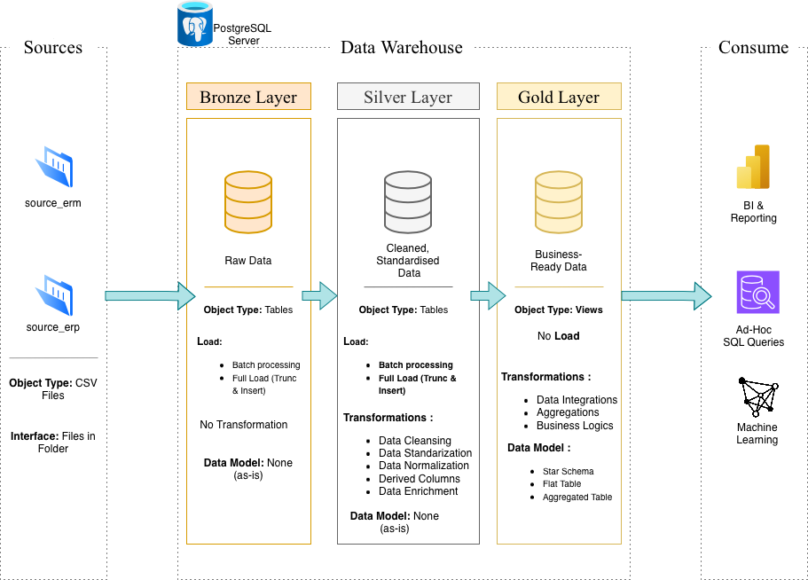

# 🛒 End-to-End Retail Data Warehouse: ERP & CRM Integration

## 📖 Project Overview

This project demonstrates a comprehensive data warehousing solution designed to consolidate sales data from disparate sources (**ERP** and **CRM**) into a centralized repository.

The goal is to move from raw, disconnected CSV files to actionable business insights using **PostgreSQL**. This repository showcases industry best practices in data modeling, data quality handling, and analytical SQL reporting.

### Key Business Objectives
* **Consolidation:** Merge operational data (ERP) with customer relationship data (CRM) into a Unified Data Model.
* **Data Quality:** Cleanse inconsistencies and handle missing values to ensure reliable reporting.
* **Analytics:** Enable stakeholders to track **Customer Behavior**, **Product Performance**, and **Sales Trends**.

---

## 🏗️ Architecture

This project follows the **Medallion Architecture** (Bronze, Silver, Gold layers) to organize the data processing pipeline within PostgreSQL.

### Data Flow layers:

1.  **Bronze Layer (Raw):**
    * Direct ingestion of source CSV files (ERP & CRM exports).
    * Data is stored in its original format (tables with `VARCHAR` types) to ensure an immutable record of the source.
2.  **Silver Layer (Cleansed & Integrated):**
    * Data typing (casting strings to Integers/Dates).
    * Data Cleaning (handling NULLs, duplicates, and standardization).
    * **Integration:** Joining ERP transaction data with CRM customer data.
3.  **Gold Layer (Analytical):**
    * Final **Star Schema** modeling for BI and reporting.
    * optimized for read-heavy analytical queries.

---

## 🛠️ Tech Stack & Tools

* **Database Engine:** PostgreSQL
* **IDE / SQL Tool:** JetBrains DataGrip
* **Modeling:** Star Schema (Kimball Methodology)
* **Visualization/Diagrams:** Draw.io
* **Source Format:** CSV (Comma Separated Values)

---

## 📊 Analytics & Insights

The project includes a suite of SQL scripts aimed at answering key business questions. Examples of insights generated:

### 1. Customer Behavior
> *Who are our top-spending customers and what is their purchasing frequency?*
* **Technique:** Aggregation by Customer ID joined with CRM segmentation data.

### 2. Product Performance
> *Which products drive the highest profit margin vs. volume?*
* **Technique:** Ranking functions (`DENSE_RANK`, `ROW_NUMBER`) over sales amount.

### 3. Sales Trends
> *How is revenue performing Month-over-Month (MoM)?*
* **Technique:** Window functions (`LAG`, `LEAD`) and time-based grouping.

---

## 🚀 How to Run This Project

### Prerequisites
* PostgreSQL installed (Local or Cloud).
* A SQL Client (DataGrip, DBeaver, or pgAdmin).
